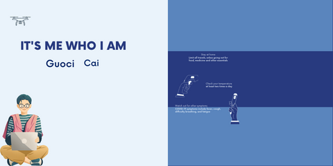

### Hi! 👋 This is ✨ CGC's github ✨
---

🧑‍🤝‍🧑 I’m an undergraduate student in a university majoring in artificial intelligence
<!--
**CGC12123/CGC12123** is a  _special_  repository because its `README.md` (this file) appears on your GitHub profile.

Here are some ideas to get you started:

- 🔭 I’m currently working on ...
- 🌱 I’m currently learning ...
- 👯 I’m looking to collaborate on ...
- 🤔 I’m looking for help with ...
- 💬 Ask me about ...
- 📫 How to reach me: ...
- 😄 Pronouns: ...
- ⚡ Fun fact: ...
-->
<!--  -->

